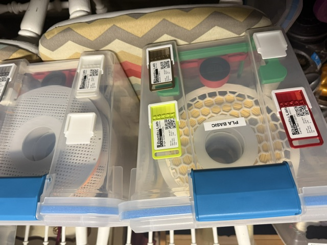
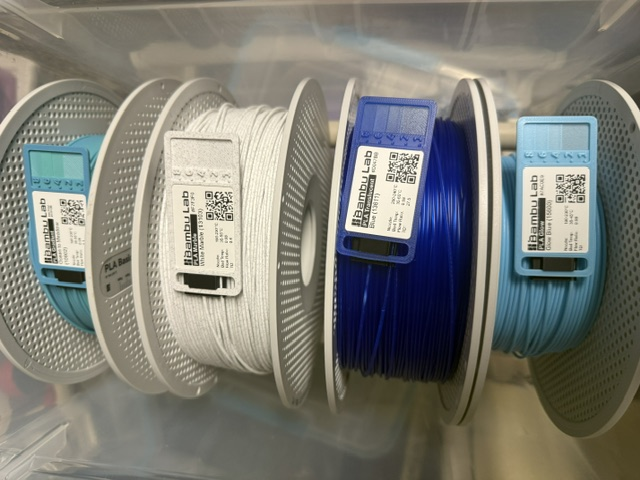
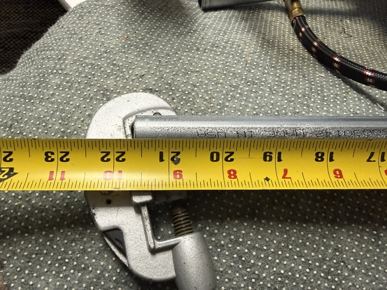
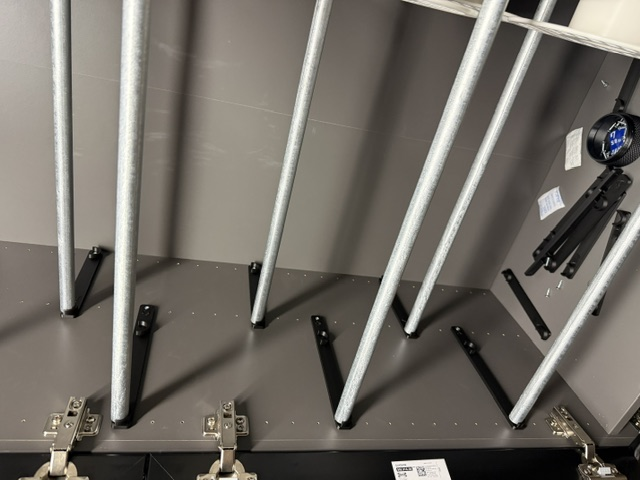
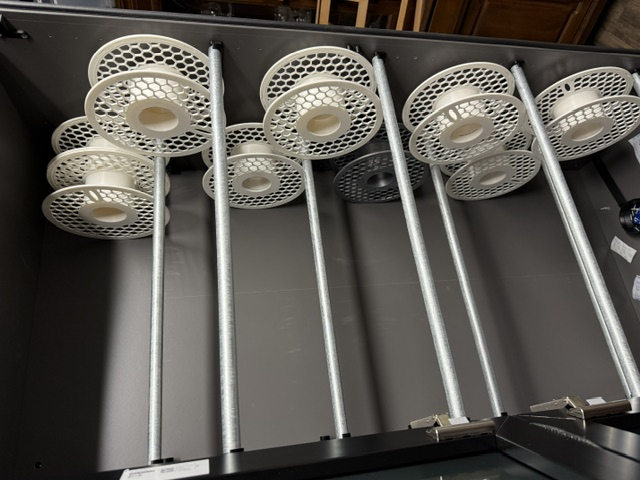

# IkeaBestaFilamentCabinet

This is my work on adapting Thera3D's cabinet plans to fit SAE measurements and supplies in my area.  
https://cults3d.com/en/3d-model/tool/ikea-besta-filament-dry-cabinet-stl-organizer-3d-printing-per-glassvik-modul

## Background

My 3D filament collection is growing quickly, and the previous drybox solution I was using is not keeping up.  
Drybox MakerWorld - https://makerworld.com/en/models/123487-drybox-sterilite-20-qt#profileId-133038
Drybox Hygrometer holder - https://makerworld.com/en/models/659940-round-hygrometer-mount-for-drybox-sterelite-20qt#profileId-587090
Hygrometer (these are everywhere) - https://www.amazon.com/dp/B098JFRNKM

I bought the plans from Thera3D over on Cults3D. Since they are based in a metric country and I am in an SAE country, things aren't a perfect match, but the concept is good.

I also needed to adapt my swatch system. Here is what the old solution looks like:

Swatch system - https://makerworld.com/en/models/544229-filament-swatch-system#profileId-461999

Here is the inspiration for my new filament clip with the attachment for the swatch:  
https://makerworld.com/en/models/980922-filament-clip-inner#profileId-954513

And the new clip solution I built:

## Current Update (2026-04-05)

* Ikea shelf purchased and assembled.  
* Rod Supports have been updated to support 1/2" EMT Conduit.  
* I found the full-length rods cause too much interference in the spools, but alternating the half-depth brackets works well.
* I also found I only needed to use the front/anterior rod holder and it worked. This may be a problem for the back-spools later on as the weight of the spools will push on the back wall, which isn't thick. That is a future-me problem.  

**Note:** These brackets are thicker than Thera3D's.  

The EMT should be cut at 21 5/8" with a standard tubing cutter.

Here is what the current spacing looks like:

Here is what some spools look like in there:

## Next Steps

1. Pull the bottom middle shelf and install the rest of the brackets/rods.
2. Install the 3 door handles (printed, but need to be located/drilled/installed).
3. Figure out a stronger magnet/mechanical closure to better compress the weather stripping (in design).
4. Figure out how to better weather seal between the glass doors (it's very tight at this time).
5. Install the LEDs (waiting on some parts).
6. Install two 1/2" wood dowels somewhere in the middle in place of the EMT Conduit. This is to keep the overall shelf system from bowing to the left/right as the IKEA shelves typically do this, but I removed them.
7. Clean/Paint the conduit black to match the brackets.
8. Install the mini Dehumidifier (https://www.amazon.com/dp/B00MQ7T038) on a Zigbee outlet (have on hand).
9. Install two Zigbee humidistats (have on hand).
10. Configure Home Assistant to control lights and the dehumidifier circuit.  

## Future Revisions Possible

1. Rear spools may need a rear support rather than pushing on the back wall. The rear support rod will likely need to be higher so the spools hit the rod and not the back.
2. Update the 4 brackets to remove the rear support on each.
