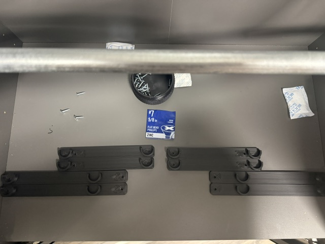

# IkeaBestaFilamentCabinet
This is my work on adapting Thera3D's cabinet plans to fit SAE measurements and supplies in my area.  

## Current Update - 
Rod Supports have been updated to support 1/2 EMT Conduit.

Note - These brackets are thicker than Thera3D's.  

The EMT should be cut at 21 5/8"

