# IkeaBestaFilamentCabinet

This is my work on adapting Thera3D's cabinet plans to fit SAE measurements and supplies in my area.  
https://cults3d.com/en/3d-model/tool/ikea-besta-filament-dry-cabinet-stl-organizer-3d-printing-per-glassvik-modul

## Background

My 3D filament collection is growing quickly, and the previous drybox solution I was using is not keeping up.  

Drybox MakerWorld - https://makerworld.com/en/models/123487-drybox-sterilite-20-qt#profileId-133038

Drybox Hygrometer holder - https://makerworld.com/en/models/659940-round-hygrometer-mount-for-drybox-sterelite-20qt#profileId-587090

Hygrometer (these are everywhere) - https://www.amazon.com/dp/B098JFRNKM

I bought the plans from Thera3D over on Cults3D. Since they are based in a metric country and I am in an SAE country, things aren't a perfect match, but the concept is good.

I also needed to adapt my swatch system. Here is what the old solution looks like:

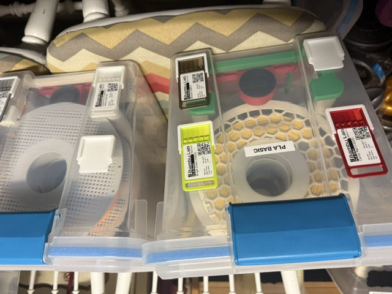

Swatch system - https://makerworld.com/en/models/544229-filament-swatch-system#profileId-461999

Here is the inspiration for my new filament clip with the attachment for the swatch:  
https://makerworld.com/en/models/980922-filament-clip-inner#profileId-954513

And the new clip solution I built:

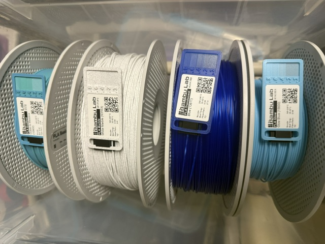  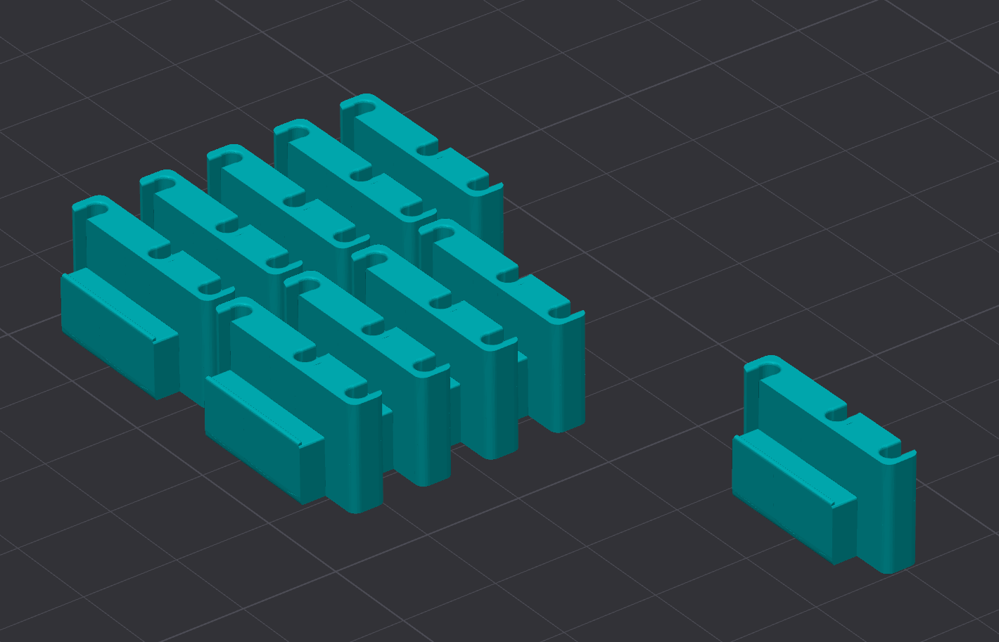

## LED Solution

There were a ton of options to make this work. I was in my local Target and saw these (https://www.target.com/p/govee-49-2--39--wi-fi-rgbic-led-strip-light--home-theater-bias-lighting/-/A-88232815) on the shelf and bought them. I think I will have some challenges with fine control via Home Assistant, but the base need of lighting up the cabinet on demand is met... and I can turn them on/off with Home Assistant locally, plus use the physical switch on the cabinet.

I needed to cut them into lengths to fit on the inside of the doors, so I bought some connectors and wire: https://www.amazon.com/dp/B09M9KT9TQ and https://www.amazon.com/dp/B09Y8W7FVR

## Current Update (2026-05-03)

* LEDs are largely done. I have to decide what to do with the excess on the second output from the Govee Controller... it is just on a spool in the top now.
* EMT Conduit "Shelves" are mostly done. I want to add an additional conduit to the rear of the rear shelves to stop the spools from pushing on the back wall since the IKEA back wall is a bit flimsy.
* I printed a bunch of the swatch/filament spool retention clips and they are working great. I uploaded the [STL file](https://github.com/RookieITSec/IkeaBestaFilamentCabinet/blob/main/Filament%20Clip%20with%20Swatch%20Holder%20V2.stl) if anyone wants it. It is a bit rough, but works.
* I currently have 64 spools in the cabinet with space for about 20 more as it is currently configured.
* Mini dehumidifier was a bust. It was unable to bring the interior humidity down at all.
* Humidity control solution I am going with is to use about 12 lbs of [Orange Desiccant beads](https://www.amazon.com/dp/B0CM7Q3F9D) in 5 [spool shaped desiccant holders](https://makerworld.com/en/models/761771-spool-sized-desiccant-silica-dryer-holder#profileId-1322489) printed in [clear ABS](https://www.amazon.com/dp/B0CHJSDQLB). I have some desiccant left over and more clear ABS so I can print more if needed, but so far it seems to be working.
* Humidity monitoring is a work in progress. I have some cheap round temp/humidity monitors in there now that just display locally. They level out at about 10%. I am unsure if this is a hard limit of the device or the actual humidity.
* Humidity Monitoring 2.0 is using some cheap Bluetooth/Zigbee connected temp/humidity monitors to feed Home Assistant. I am fairly confident these sensors do not work well or at all below ~20-25% relative humidity and it is throwing off my Home Assistant data. My current dashboard is still a work in progress, but check out the progress photos below.
* Humidity Monitoring 3.0 is in the works. I purchased a [3.5" CYD ESP32 based device](https://www.amazon.com/dp/B0D4VFCB3N) and a handful of [GY-SHT31-D Temperature and Humidity Sensor Modules](https://www.amazon.com/dp/B0FCF7928F) to better, more accurately track the humidity and temp and basically evolve the Humidity 2.0 project.

### Remaining Action Items
1. Cut 5 more 1/2" EMT sections and paint them. These will go in the back of the back spool holders. The current spools push on the back wall too much.
2. Weather seal between the doors. I purchased a second type of thinner weather stripping for between the doors. While the desiccant can keep up with the humidity so far, I want to seal it a bit better.
3. Build Humidity Sensor 3.0 setup.

### Future Enhancements
1. Better LEDs. Flat and not weather resistant ones would be ideal.
2. Better LED controller. The Govee controller works, but it only passes some basic on/off controls to Home Assistant. I want more control via Home Assistant for better automations.
3. Better filament clip swatch holder. I am thinking one with a larger hole to run the filament through, and then when it comes around the spool, it would snap in like it does now. Minor, but possible.

### Updates on Previous Action Items
* Pull the bottom middle shelf and install the rest of the brackets/rods.
  * *Done*
* Install the 3 door handles (printed, but need to be located/drilled/installed).
  * *1/3 done*
* Figure out a stronger magnet/mechanical closure to better compress the weather stripping (in design).
  * *Done.* [STL Files](https://github.com/RookieITSec/IkeaBestaFilamentCabinet/blob/main/North-RollerCatch.stl)
* Figure out how to better weather seal between the glass doors (it's very tight at this time).
  * *New [weather seal](https://www.amazon.com/dp/B0C4G9ZB2G) on hand and will install soon.* Detail: Size: 0.2 x 0.4 x 32.8 FT | Color: Grey-Brush Strip
* Install the LEDs (waiting on some parts).
  * *Done, but future enhancements possible.*
* Install two 1/2" wood dowels somewhere in the middle in place of the EMT Conduit. This is to keep the overall shelf system from bowing to the left/right as the IKEA shelves typically do this, but I removed them.
  * *Done.* Trim screw heads are visible on the outside, but not a big deal.
* Clean/Paint the conduit black to match the brackets.
  * *Done*
* Install the [mini Dehumidifier](https://www.amazon.com/dp/B00MQ7T038) on a Zigbee outlet (have on hand).
  * *Done but changed plans and removed.*
* Install two Zigbee humidistats (have on hand).
  * *Done, but working on the next revision currently.*
* Configure Home Assistant to control lights and the dehumidifier circuit.
  * *Partially done.* LED control will be part of the humidity sensor to help display real-time status in the future.

### Progress Photos
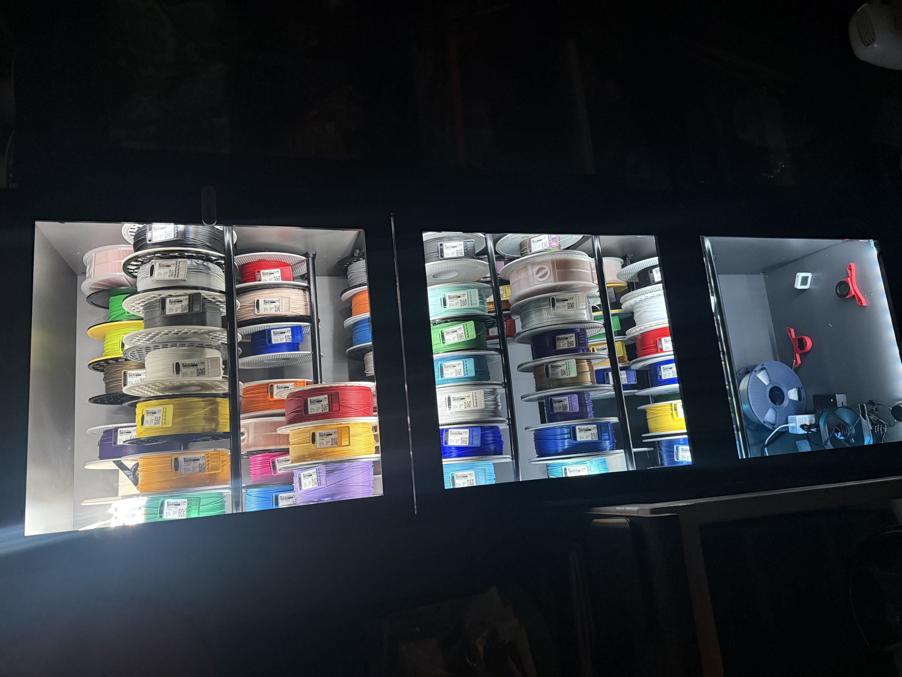
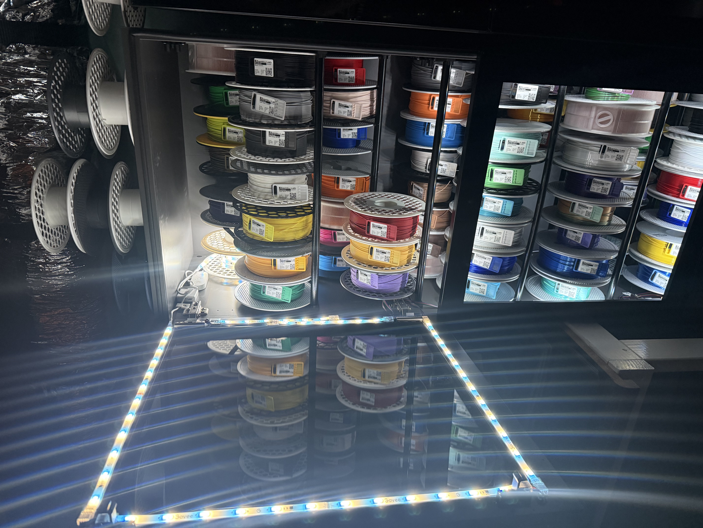
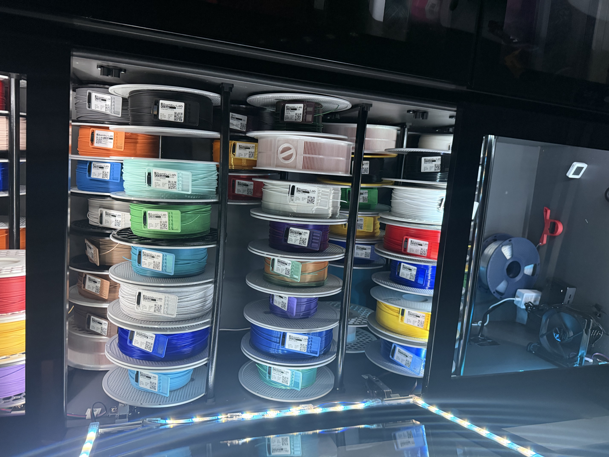
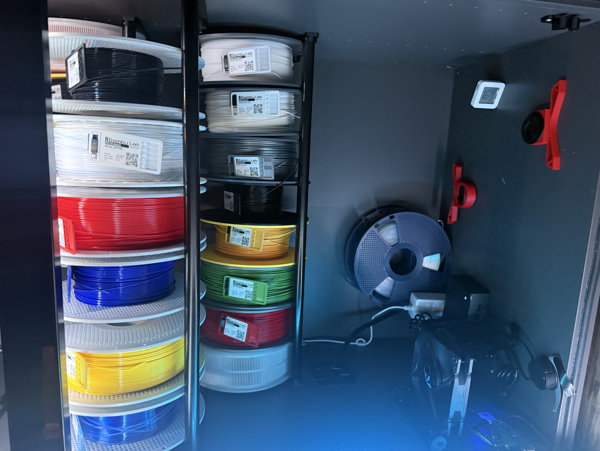
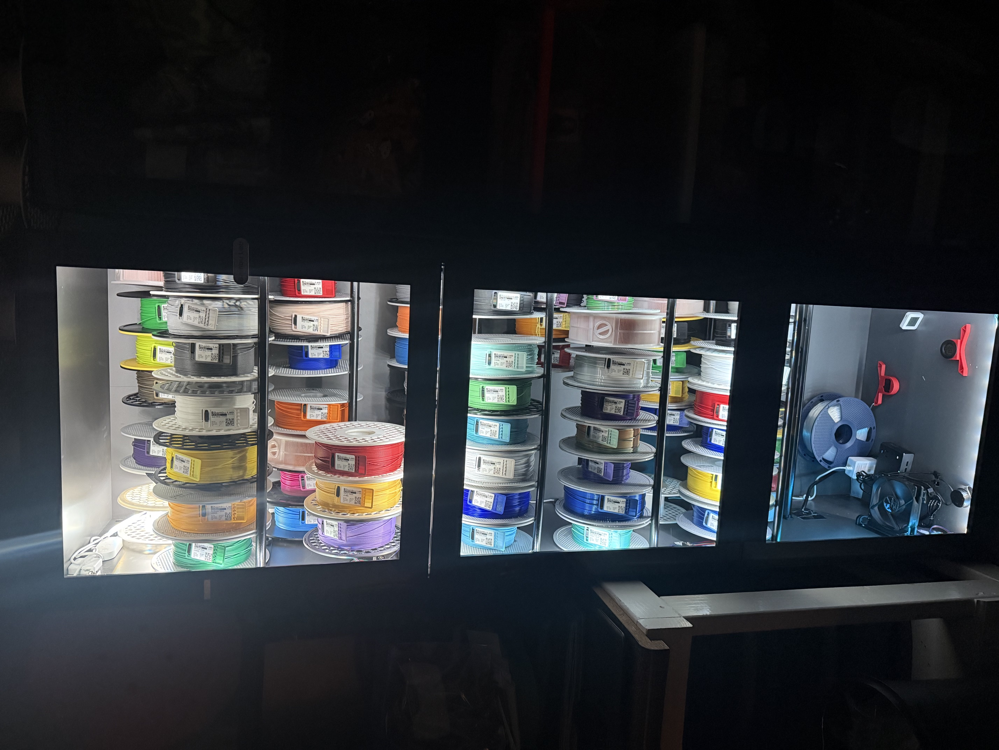

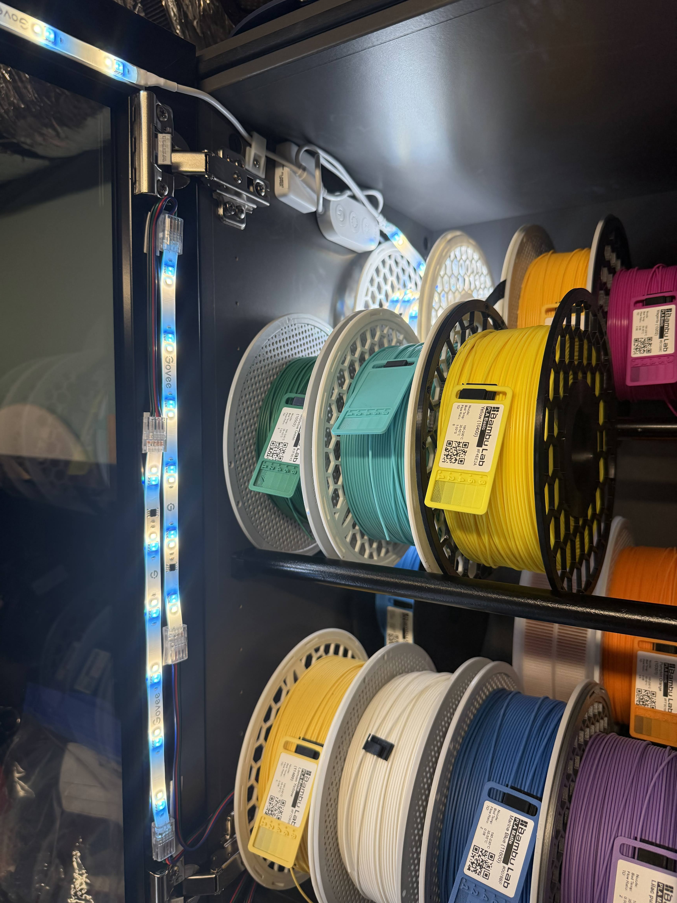
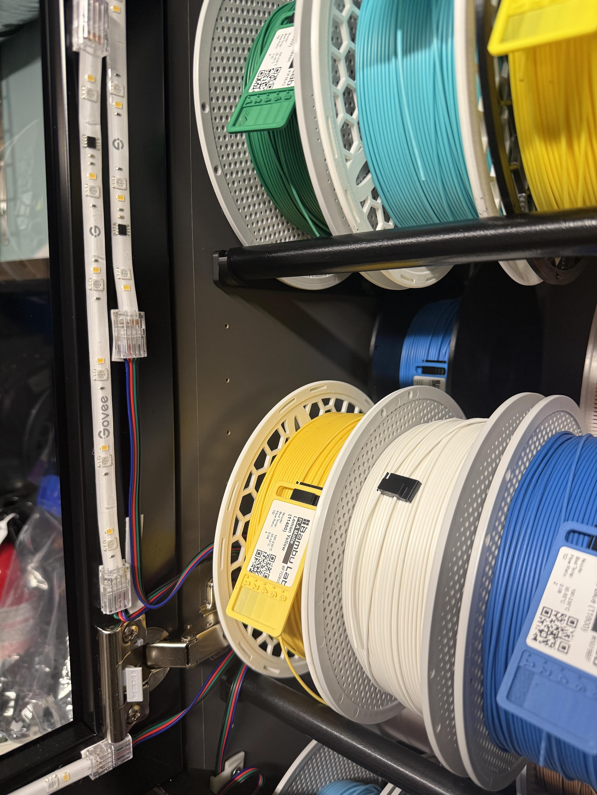
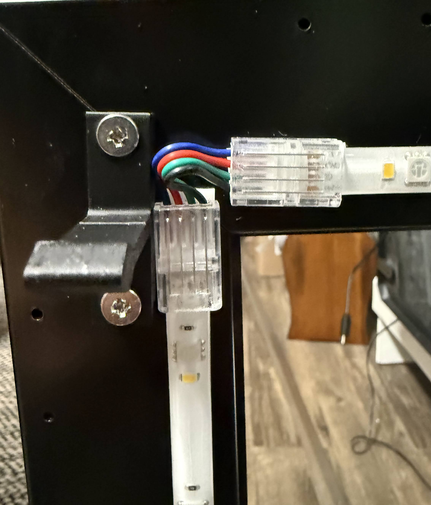
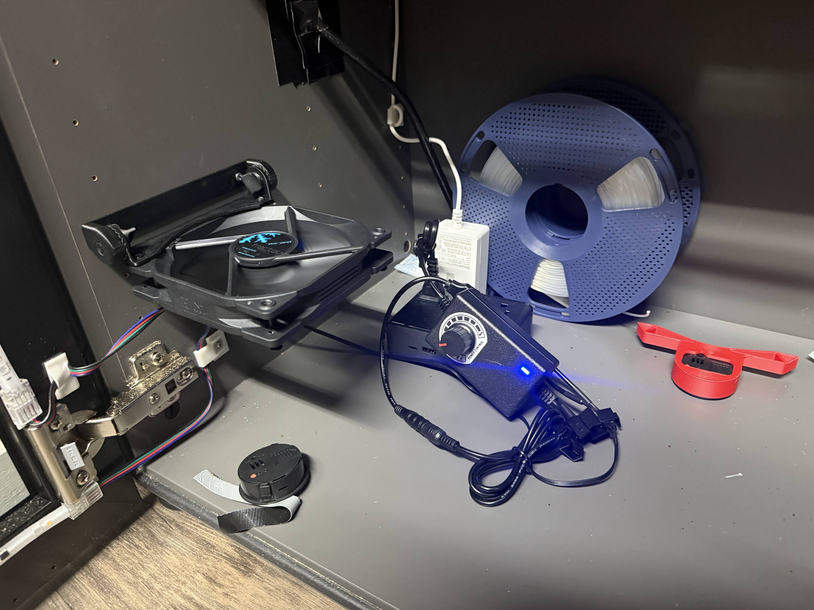

## Update (2026-04-19)

* All rods are painted.  Most are 1/2 EMT, but 2 are 1/2 wooden dowels that have screws through from the outside.  I drilled inside out and then installed the screw.  Dowels were also pre-drilled.  
* LEDs are in process.
* Uploaded [my stl files](https://github.com/RookieITSec/IkeaBestaFilamentCabinet/tree/main/half%20rods) for the holders by request.  These were printed in standard Bambu Basic PLA and seem to work fine.  Note - these are adapted from Thera3d's plans and I may remove these from here in the future.  
* Progress photos -
  
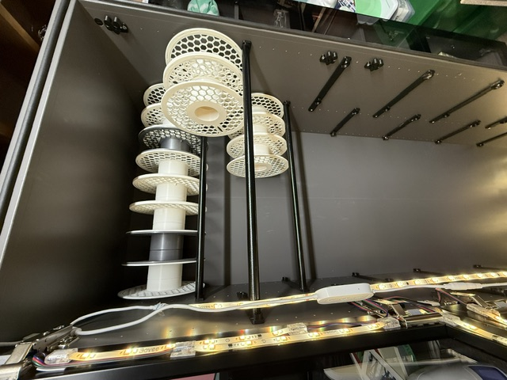
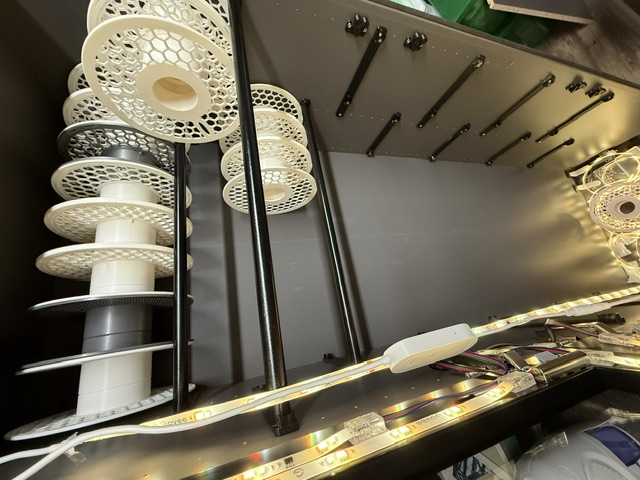
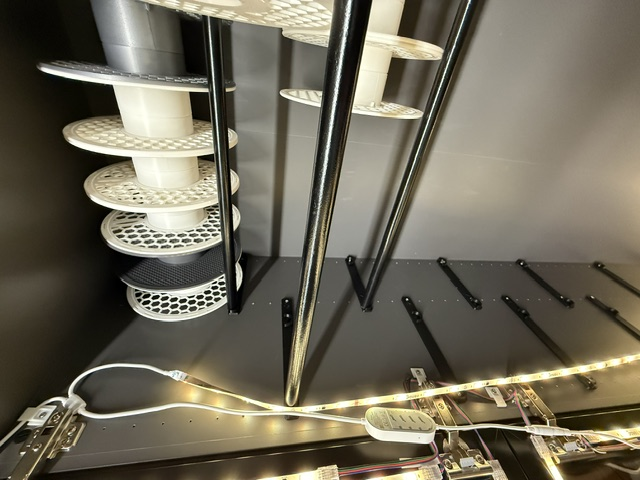
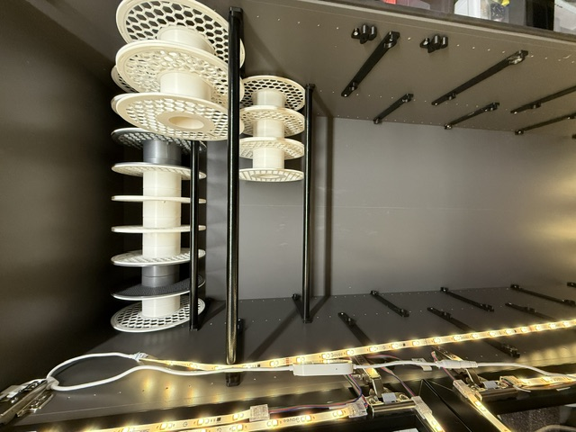

## Update (2026-04-05)

* Ikea shelf purchased and assembled.  
* Rod Supports have been updated to support 1/2" EMT Conduit.  
* I found the full-length rods cause too much interference in the spools, but alternating the half-depth brackets works well.
* I also found I only needed to use the front/anterior rod holder and it worked. This may be a problem for the back-spools later on as the weight of the spools will push on the back wall, which isn't thick. That is a future-me problem.  

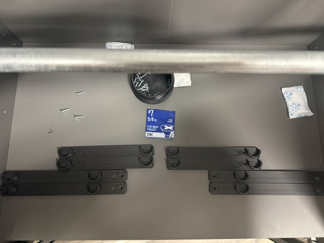

**Note:** These brackets are thicker than Thera3D's.  

The EMT should be cut at 21 5/8" with a standard tubing cutter.

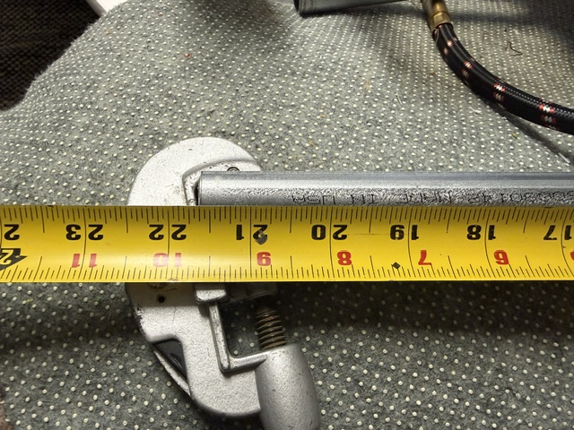

Here is what the current spacing looks like:

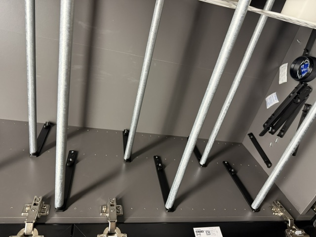

Here is what some spools look like in there:

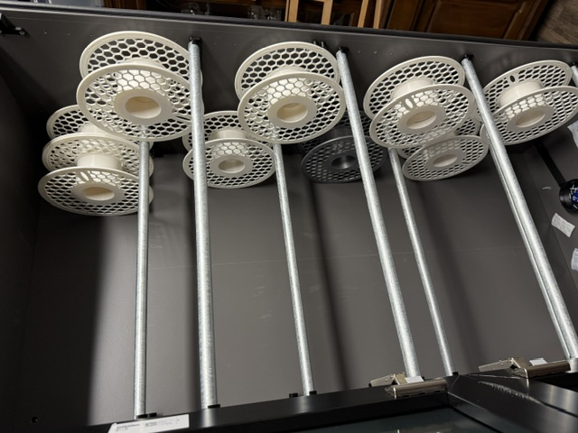

Here is a screencap of what the brackets look like.  

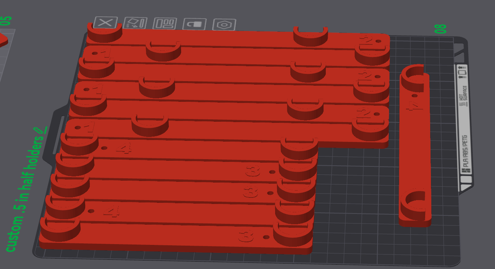

## Next Steps

1. Pull the bottom middle shelf and install the rest of the brackets/rods.
2. Install the 3 door handles (printed, but need to be located/drilled/installed).
3. Figure out a stronger magnet/mechanical closure to better compress the weather stripping (in design).
4. Figure out how to better weather seal between the glass doors (it's very tight at this time).
5. Install the LEDs (waiting on some parts).
6. Install two 1/2" wood dowels somewhere in the middle in place of the EMT Conduit. This is to keep the overall shelf system from bowing to the left/right as the IKEA shelves typically do this, but I removed them.
7. Clean/Paint the conduit black to match the brackets.
8. Install the mini Dehumidifier (https://www.amazon.com/dp/B00MQ7T038) on a Zigbee outlet (have on hand).
9. Install two Zigbee humidistats (have on hand).
10. Configure Home Assistant to control lights and the dehumidifier circuit.  

## Future Revisions Possible

1. Rear spools may need a rear support rather than pushing on the back wall. The rear support rod will likely need to be higher so the spools hit the rod and not the back.
2. Update the 4 brackets to remove the rear support on each.
